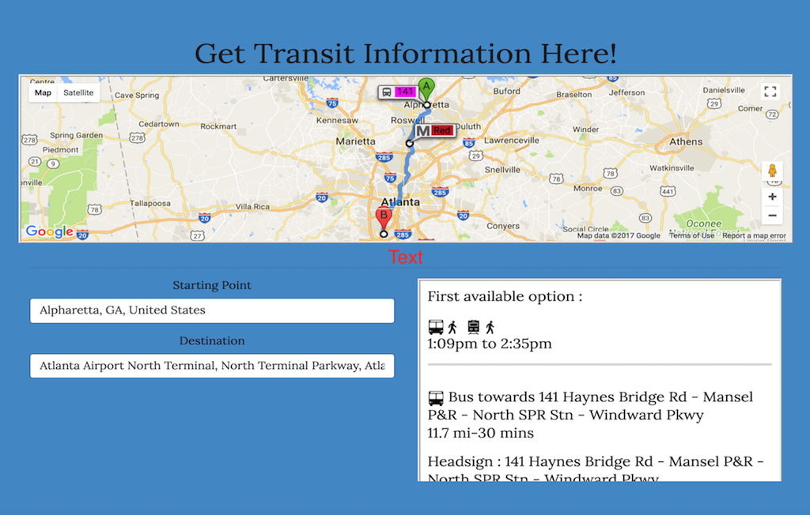

 # Transit App
 
 ### Live https://melavanya.github.io/Public-Transit/

### About the App

Using Google Maps API, this application provides transit options and instructions from Point A to Point B, 
thus enabling fuel conservation and encouraging public transportation.

### Features

- Enter Starting point and Destination 
- Get the earliest transit option available with number of stops and all detailed step-wise instructions

### Technology Used

### Front-end
- HTML5, CSS3, Javascript, jQuery, Bootstrap
### API 
- Google maps API
